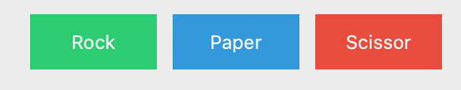
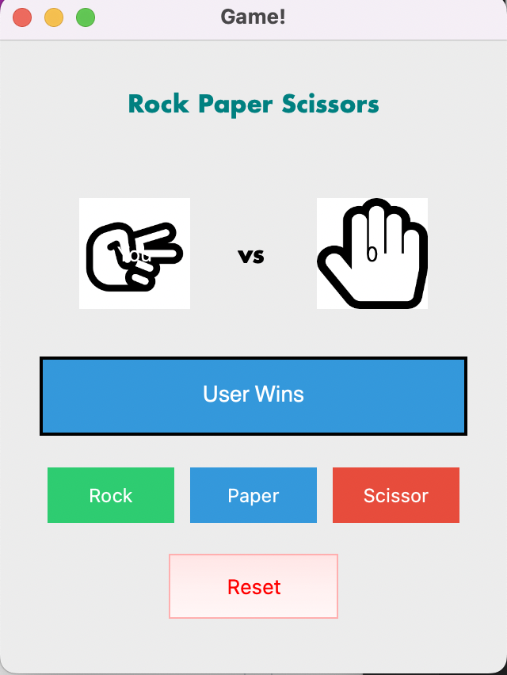
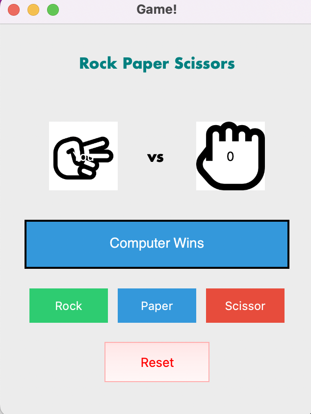

# Which package/library did you select?
I chose a python library named PyQt5, a GUI based python package.

# What is the package/library?
What purpose does it serve?

PyQt5 is based on Qt application framework, so PyQt5 assists the users to build application using python and Qt framework's utilites.

Major purpose of this package is to assist users in developing graphical user interfaces. 
Various widgets and tools are provided as part of this package to make the interface user friendly. Some examples are provided below:

How do you use it?

a. To create a button:
`button = QPushButton('Rock')`

b. To shape/beautify the above button, user can set the geometry too:
`button.setGeometry(100, 100, 200, 50)`

c. User can use various layouts supported by PyQt5, one such layout is "HBox":

`hbox = QHBoxLayour()`
`hbox.addWidget(self.firstButton)`
`hbox.addWidget(self.secondButton)`

# What are the functionalities of the package/library?

Creating and Styling header label:
        # creating head label
        head = QLabel("Rock Paper Scissors", self)

        # setting geometry to the head
        head.setGeometry(20, 10, 280, 60)

        # font
        font = QFont('Futura', 15)
        font.setBold(True)

        # setting font to the head
        head.setFont(font)

        # setting alignment of the head
        head.setAlignment(Qt.AlignCenter)

        # setting color effect to the head
        color = QGraphicsColorizeEffect(self)
        color.setColor(Qt.darkCyan)
        head.setGraphicsEffect(color)

Creating and Styling buttons:

        self.rock = QPushButton("Rock", self)
        self.rock.setGeometry(30, 270, 80, 35)
        self.rock.setStyleSheet(
            "background-color: #2ecc71; color: white; border: none; padding: 5px; font-size: 12px;")
        self.paper = QPushButton("Paper", self)
        self.paper.setGeometry(120, 270, 80, 35)
        self.paper.setStyleSheet(
            "background-color: #3498db; color: white; border: none; padding: 5px; font-size: 12px;")
        self.scissor = QPushButton("Scissor", self)
        self.scissor.setGeometry(210, 270, 80, 35)
        self.scissor.setStyleSheet(
            "background-color: #e74c3c; color: white; border: none; padding: 5px; font-size: 12px;")

Sample output when user wins:

Sample output when user loses:

# When was it created?
The base version, PyQt was released in 1998 whereas the latest version PyQt5 came into existence from 2016.

# Why did you select this package?
This package was selected because it offers enormous functionality to build attractive user interfaces and interactive desktop applications.

# How did learning the package/library influence your learning of the language?

Learning this package unveiled yet another super useful feature of python in building interactive user interfaces. Keeping in mind how important interfaces are to the applications, this package cannot go unnoticed.

# How was your overall experience with the package/library?
 1. When would you recommend this package/library to someone?
 This library is recommend to anyone working to build interfaces.

 2. Would you continue using this package/library? Why or Why not?
 This package is definitely going to be on my to-use list since I frequently with building interfaces and front end stuff.

 # References
 [1] Sample PyQt tutorial [link...](https://www.pythonguis.com/pyqt5-tutorial/)

 [2] Event Handlers in PyQt5 [link...](https://doc.qt.io/qtforpython-6/overviews/eventsandfilters.html)
